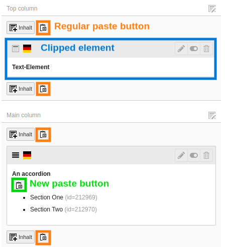

# TYPO3 Extension dragon_drop

This extension provides fluid viewhelpers to add copy/paste functionality to EXT:mask backend templates.

## CopyRecord/CutRecord ViewHelper

These two viewhelpers can be used within backend templates to provide "copy CE" and "cut CE" links:

```xml
<html data-namespace-typo3-fluid="true"
      xmlns:f="http://typo3.org/ns/TYPO3/CMS/Fluid/ViewHelpers"
      xmlns:dnd="http://typo3.org/ns/Kitzberger/DragonDrop/ViewHelpers">

<div class="mask-element">
    <dnd:be.copyRecord uid="{row.uid}" />
    <dnd:be.cutRecord uid="{row.uid}" />
    <h4>{row.header}</h4>
</div>
```

## PasteLink ViewHelper

This viewhelper can be used within backend templates to provide a paste link for "clipped" CEs within container elements.

```xml
<html data-namespace-typo3-fluid="true"
      xmlns:f="http://typo3.org/ns/TYPO3/CMS/Fluid/ViewHelpers"
      xmlns:dnd="http://typo3.org/ns/Kitzberger/DragonDrop/ViewHelpers">

<div class="mask-accordion">
    <dnd:be.pasteLink target="{row}"
                      override="{colPos:999, tx_mask_accordion_items_parent: row.uid}" />

    <ul>
        <f:for each="{data.tx_mask_accordion_items}" as="item">
            <li>
                {item.header} (id={item.uid})
            </li>
        </f:for>
    </ul>
</div>
```

This'll render an extra paste button into the accordion element:



These are the attributes

* `target` which needs to be set to a array representing the target record. Currently only the array key `pid` is being used internally.
* `override` which contains the field modifications the newly created record will be updated with. For EXT:mask containers that's at least colPos=999 and the "parent field".

This extension comes with a DataHandler hook that updates the "children count" field of the container after attaching the copied CE to it. The name of said "children count" will be derived from TCA.

### Compatibility with EXT:mask

In order to make this work with EXT:mask you need to make sure that the "parent field" is present in TCA. Please check the configuration module in the backend.

If it's not present (yet) you need to provide it yourself, see [github.com/Gernott/mask/issues/389](https://github.com/Gernott/mask/issues/389) for details.

### Prevent hidden records

In case you don't want the paste record to be hidden, you can override the `hidden` property with 0 via the `override` attribute, e.g.

```xml
<dnd:be.pasteLink target="{row}"
                  override="{colPos:999, tx_mask_accordion_items_parent: row.uid, hidden:0}" />
```

### Allowed CTypes

To prevent certain CTypes to be pasted into your mask element you can specify the `allowed` attribute:

```xml
<dnd:be.pasteLink target="{row}"
                  override="{colPos:999, tx_mask_accordion_items_parent: row.uid}"
                  allowed="textmedia,mask_elementX" />
```

### Customize button text

In case you don't want the button text to be that paste icon, you can set a different button text:

```xml
<dnd:be.pasteLink target="{row}" ...>
    Paste here
</dnd:be.pasteLink>
```

### WIP: Drag & Drop

```xml
<dnd:be.dropzone target="{row}"
                 override="{colPos:999, tx_mask_accordion_items_parent: row.uid}" />
```

If you want a CE within a container to be draggable to the outside make sure it's provided with the proper markup/classes:

```xml
<ul>
    <f:for each="{data.tx_mask_accordion_items}" as="item">
        <li>
            <div class="t3-page-ce t3js-page-ce" data-table="tt_content" data-uid="{item.uid}">
                <div class="t3-page-ce-header t3-page-ce-header-draggable t3js-page-ce-draghandle">
                    {item.header} (id={item.uid})
                </div>
            </div>
        </li>
    </f:for>
</ul>
```
